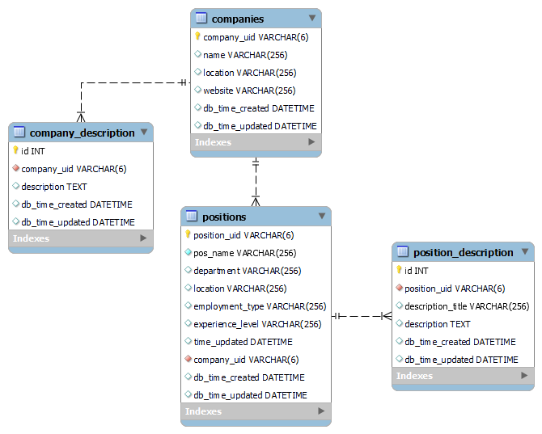

## super_cool_data_mining_project
The project: a web scraper for finding job positions from comeet.com company pages
* comeet.com is an ATS commonly used by Israeli hi-tech companies. Their company pages are available via direct link, but will not show up in a Google search. 
* We biased our results to get jobs that are related to our area of study - data science.
* Currently, the scraper returns the first 99 Google results for job positions, allowing us to scrape for data from more than 60 companies.

### Part 1
1. An API is used to collect results from Google using the common url pattern for job positions used by comeet.com.
2. The urls for each job position are extracted from our results.

### Part 2
3. Each url is sliced to find the company's main page of job listings.
4. From within the company's page, we extract the element which contains the company data and the positions' data.
5. The information is stored in the "comeet_jobs" database.
6. You get to search for your dream job!

Part 1 contains general code for collecting urls from a Google search, whereas part 2 is specific to the build of the web pages we worked on.

## To run the scrape:
1. This code was written in Python 3.9, make sure your working environment can run this code.
2. Save this repo to a local directory.
    > `git clone https://github.com/batyaamericus/super_cool_data_mining_project.git`
3. Move to the super_cool_data_mining_project directory that you just created.
    > `cd super_cool_data_mining_project`
4. Make sure that all of the requirements in the requirements.txt are met by your working environment.
5. In order to create your database:
   1. open the config.py file and insert the username, password and host for your MySQL database
   2. run the database.py file to create your database
       > in command line: `python database.py`
6. To populate your database, run scraping.py.
    > in command line: `python scraping.py`
8. Run user_interface_menu.py!
    > in command line: `python user_interface_menu.py`
9. If you would like to find more jobs that are not yet in the database, you can manually run the scraping.py file again.
* if your operating system does not recognise the `python` command, try running `python3`

## The database:
Each time you run the scrape, information is gathered by company and stored in the comeet_jobs database as described below.

